# DevSecOps CI/CD Project 
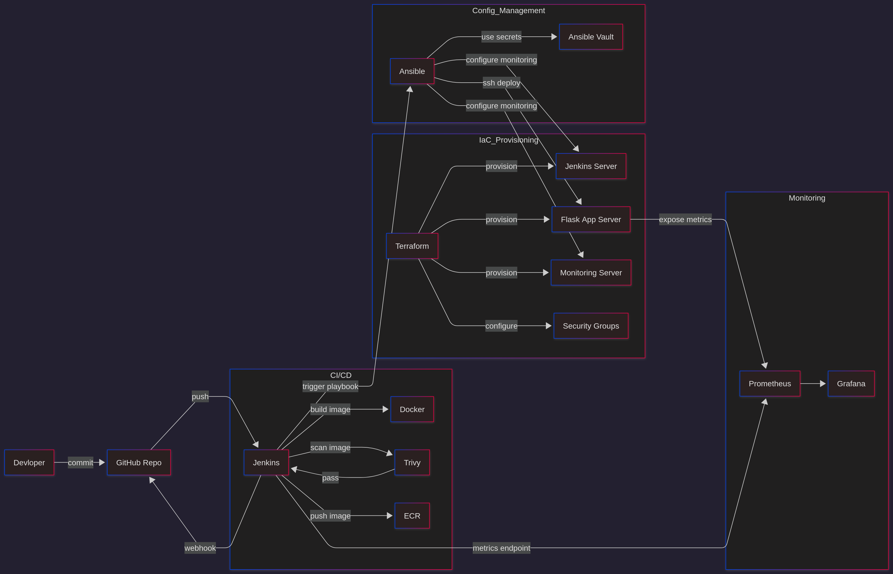


**Project goal:** Build a full DevSecOps pipeline that builds, scans, pushes and deploys a Flask app using Docker, stores images in AWS ECR, provisions infrastructure with Terraform, configures servers with Ansible, secures pipeline with Trivy & Ansible Vault, and monitors with Prometheus + Grafana. This README documents everything you used and every step needed to reproduce, maintain and secure the workflow.

---

## Table of contents

1. Project overview & architecture
2. Folder structure (recommended)
3. Prerequisites (local & cloud)
4. Terraform — provision EC2 + IAM + security groups (step-by-step)
5. Ansible — configure servers & deploy containers (roles & playbooks)
6. Jenkins pipeline — build, scan, push, deploy (Jenkinsfile)
7. Security: Trivy, SonarQube (optional), Ansible Vault, Jenkins credentials, IAM least privilege
8. Monitoring: Prometheus + Grafana + Node Exporter + Jenkins metrics plugin
9. Correct workflow (step-by-step) + mermaid diagram for workflow image
10. Troubleshooting & common pitfalls
11. Useful commands & snippets
12. Next improvements & checklist

---

## 1 — Project overview & architecture

High-level components:

* **GitHub**: source repo (your app + infra + ansible)
* **Jenkins**: CI server (build image, run security scans, push to ECR, trigger Ansible deploy)
* **Docker**: containerize Flask app
* **AWS ECR**: Docker registry for images
* **Terraform**: create EC2 instances, security groups, IAM roles/profiles
* **Ansible**: install runtime components on EC2 and run deploy tasks
* **Trivy**: container image vulnerability scanner integrated in pipeline
* **Ansible Vault**: secrets management for playbooks
* **Prometheus + Grafana**: monitoring & dashboards (Prometheus scrapes Node Exporter + app metrics, Grafana visualizes)
* **Jenkins Prometheus plugin**: optional for Jenkins metrics
* **Optional**: SonarQube for code quality (can be Dockerized or external)

---

## 2 — Recommended folder structure

```
devsecops-pipeline-with-ansible-terraform/
├── app/
│   ├── Dockerfile
│   ├── app.py
│   └── requirements.txt
├── ansible/
│   ├── inventory.ini
│   ├── playbook.yml
│   ├── group_vars/
│   └── roles/
│       ├── flask_app/
│       │   ├── tasks/main.yml
│       │   └── templates/
│       ├── jenkins_setup/
│       └── monitoring/
├── terraform/
│   ├── main.tf
│   ├── variables.tf
│   ├── provider.tf
│   └── outputs.tf
├── Jenkinsfile
├── README.md
└── docs/
    └── workflow-mermaid.txt
```

---

## 3 — Prerequisites

**Local dev machine (Jenkins host or where you run CI):**

* Git, Docker, Python3, pip, Ansible, aws-cli v2, Trivy, ngrok (optional)
* Jenkins (installed either on a VM/container or as a system package)
* Jenkins user added to Docker group: `sudo usermod -aG docker jenkins` (then restart/relauch session)

**AWS:**

* AWS account with ECR & EC2 ability
* An IAM user (for CI) with minimal policies for ECR push (AmazonEC2ContainerRegistryPowerUser or fine-grained)
* Key pair (private `.pem`) you downloaded and will map to Terraform `key_name`.

**Security:**

* Don’t commit private keys or AWS secrets. Use Jenkins credentials & Ansible Vault.

---

## 4 — Terraform: Provision EC2, SG, IAM (step-by-step)

**Goals:** create three EC2 (flask, jenkins, monitoring) t3.micro (free-tier where available), create security group, IAM role/profile for ECR read/pull.

**Basic pieces** 
### Provider.tf
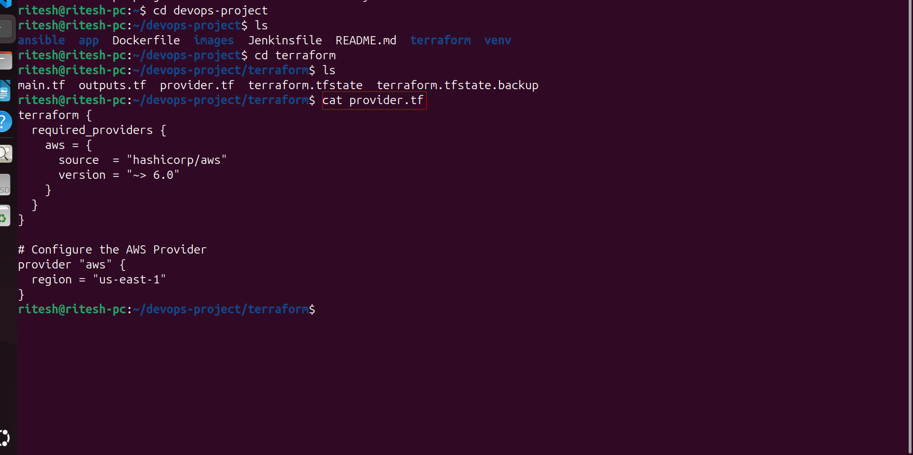


---
### outputs.tf
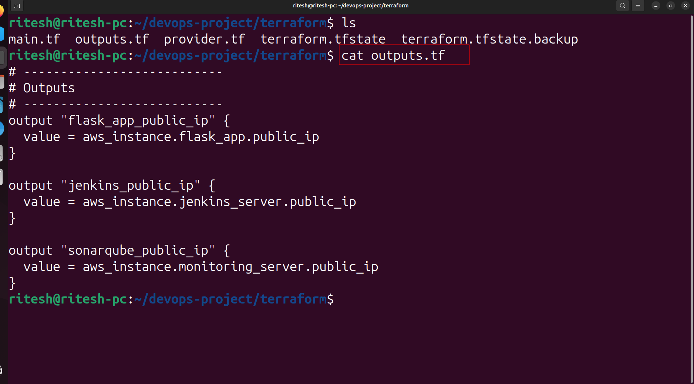

---

### main.tf

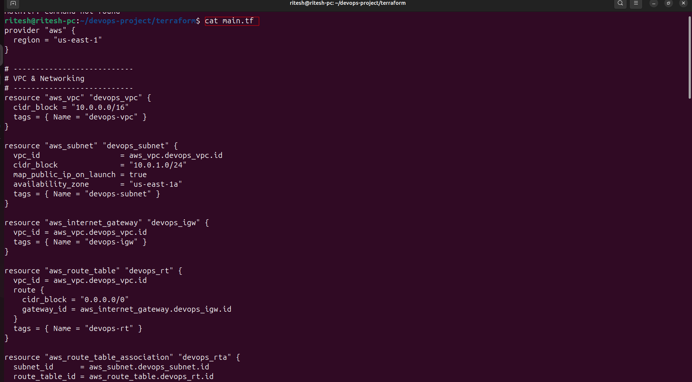
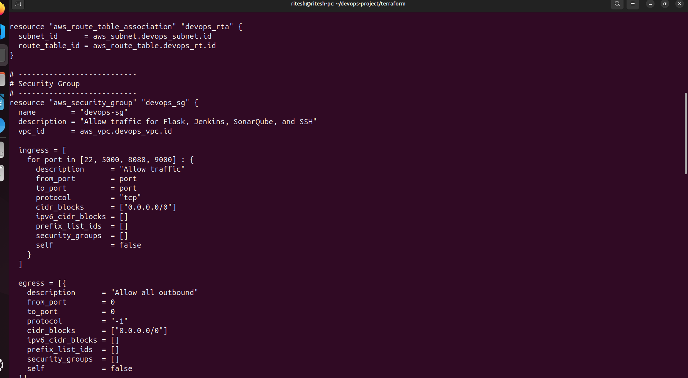
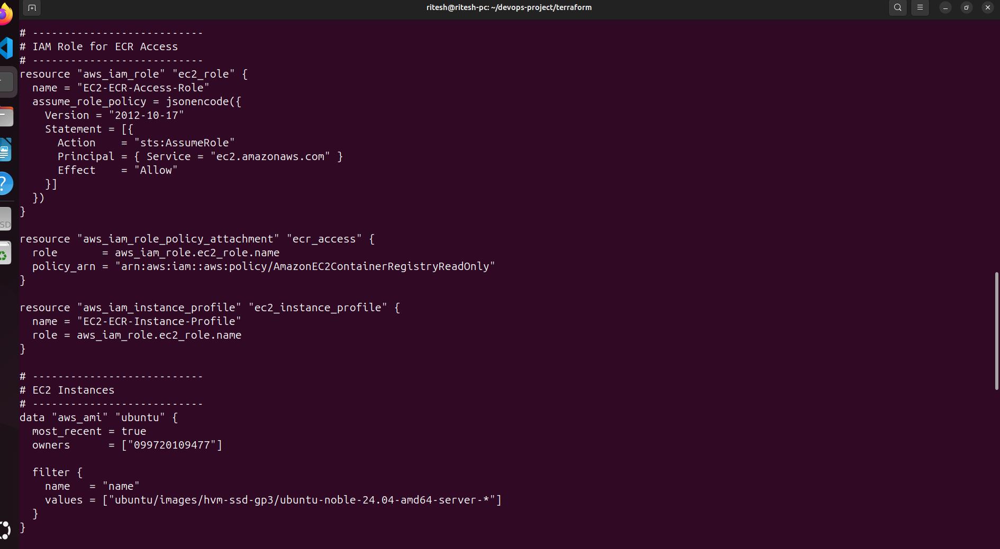
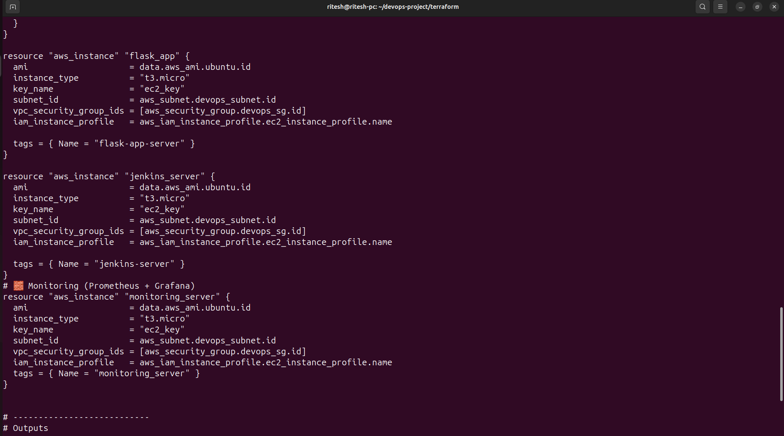

---


**Notes & tips:**

* Always use `key_name` that matches an existing EC2 key pair (you create the key in AWS console once and reference its name).
* Lock SSH (`22`) to your IP via CIDR for production safety.
* Avoid user_data for complex provisioning if you use Ansible to configure servers — keep Terraform for infra only.

---

## 5 — Ansible: configure servers & deploy containers

**Inventory (`ansible/inventory.ini`) example:**

```
[flask_server]
34.238.165.116 ansible_user=ubuntu

[jenkins_server]
18.207.168.154 ansible_user=ubuntu

[monitoring_server]
10.0.1.163 ansible_user=ubuntu
```
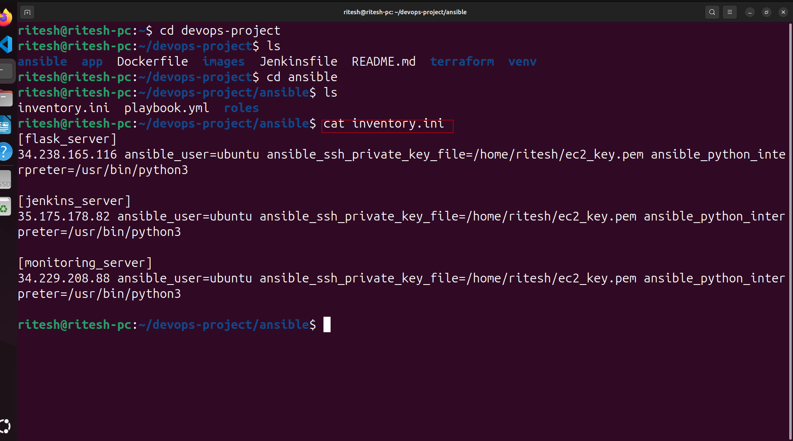

---


**Playbook (`ansible/playbook.yml`)**

```yaml
---
- hosts: flask_server
  become: yes
  roles:
    - flask_app

- hosts: jenkins_server
  become: yes
  roles:
    - jenkins_setup

- hosts: monitoring_server
  become: yes
  roles:
    - monitoring
```
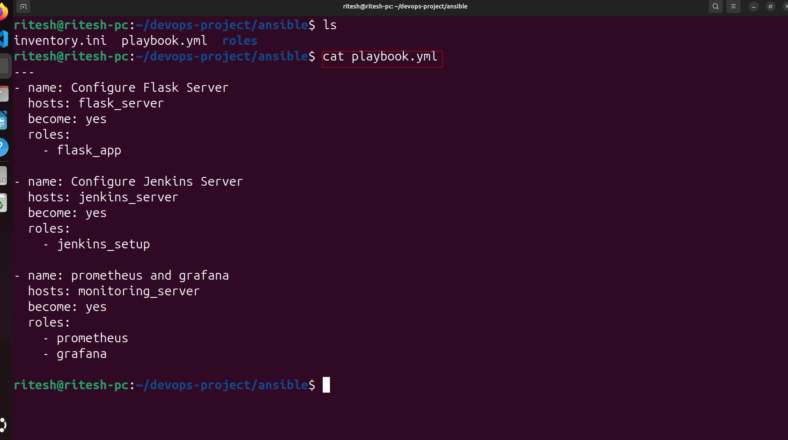

---

**Role `flask_app/tasks/main.yml` (example):**
**flask_app_role**
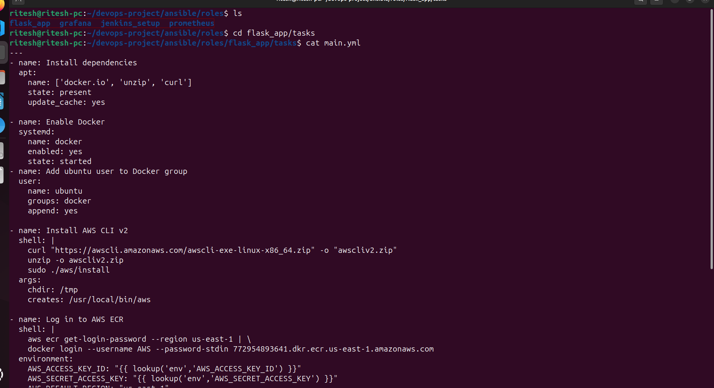

---

**jenkins_setup role**

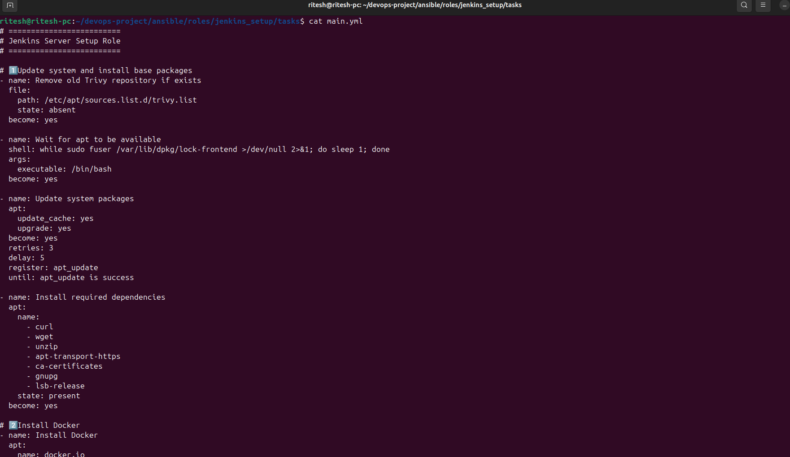
```
- name: Install Docker & AWS CLI v2
  apt:
    name: ['docker.io', 'unzip', 'python3-pip']
    update_cache: yes
    state: present

- name: Ensure docker started
  systemd:
    name: docker
    state: started
    enabled: yes

- name: Install AWS CLI v2 (if not present) - script tasks...
- name: Log in to ECR
  shell: |
    aws ecr get-login-password --region {{ aws_region }} | docker login --username AWS --password-stdin {{ ecr_repo_domain }}
  environment: { AWS_ACCESS_KEY_ID: "{{ lookup('env','AWS_ACCESS_KEY_ID') }}" }
  args: { warn: false }
  register: login_result
  failed_when: login_result.rc != 0 and ('Unable to locate credentials' in login_result.stderr == False)

- name: Pull image
  docker_image:
    name: "{{ ecr_repo }}:{{ image_tag }}"
    source: pull
```


**Tips:**

* Use `docker_image` module where possible.
* For ECR login, run with IAM role (preferred) or provide credentials via env/credentials file on host. If the EC2 has the appropriate IAM instance profile (ECR pull policy), you do not need to store AWS keys on the host.
* Use `become: yes` for system-level tasks.
* Avoid referencing local PEM path in `inventory.ini` — use Jenkins `sshagent` to provide keys at runtime. Inventory entries should be `ansible_user=ubuntu`.

---

##  6 — Jenkinsfile (CI pipeline — build, scan, push, deploy)

**Key points:**

* Use Jenkins credentials:

  * `aws-credentials` (AWS access key + secret) or use IAM role for Jenkins agent.
  * `ansible-ec2-key` (SSH private key)
* Ensure `trivy` is installed or install in pipeline before using it.

**Example Jenkinsfile**:
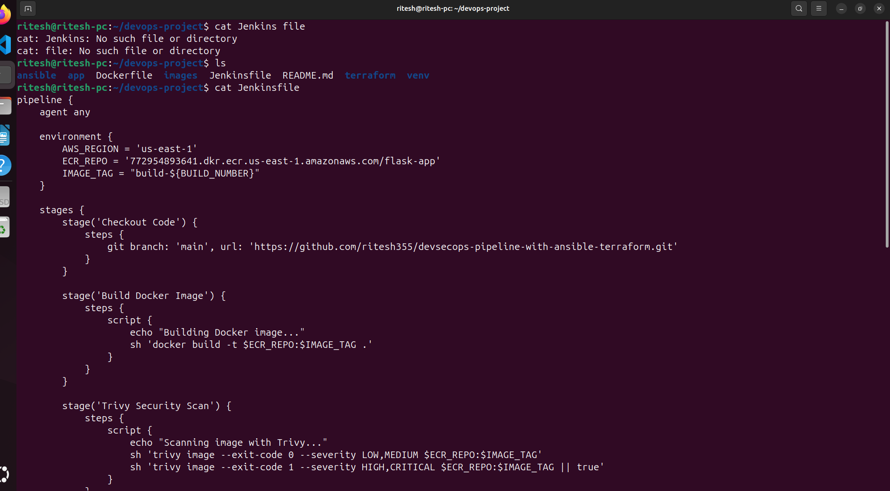


```groovy
pipeline {
  agent any
  environment {
    AWS_REGION = 'us-east-1'
    ECR_REPO = '772954893641.dkr.ecr.us-east-1.amazonaws.com/flask-app'
    IMAGE_TAG = "build-${BUILD_NUMBER}"
  }
  stages {
    stage('Checkout') { steps { git url: 'https://github.com/ritesh355/devsecops-pipeline-with-ansible-terraform.git', branch:'main' } }
    stage('Install Trivy if needed') {
      steps {
        sh '''
          if ! command -v trivy >/dev/null 2>&1; then
            curl -sfL https://raw.githubusercontent.com/aquasecurity/trivy/main/contrib/install.sh | sudo sh -s -- -b /usr/local/bin
          fi
          trivy --version
        '''
      }
    }
    stage('Build') {
      steps { script { sh "docker build -t ${ECR_REPO}:${IMAGE_TAG} ." } }
    }
    stage('Scan') {
      steps {
        sh "trivy image --exit-code 1 --severity HIGH,CRITICAL ${ECR_REPO}:${IMAGE_TAG} || true"
      }
    }
    stage('Push to ECR') {
      steps {
        withCredentials([[$class: 'AmazonWebServicesCredentialsBinding', credentialsId: 'aws-credentials']]) {
          sh '''
            aws ecr get-login-password --region ${AWS_REGION} | docker login --username AWS --password-stdin ${ECR_REPO}
            docker push ${ECR_REPO}:${IMAGE_TAG}
          '''
        }
      }
    }
    stage('Deploy via Ansible') {
      steps {
        sshagent (credentials: ['ansible-ec2-key']) {
          sh '''
           cd ansible
           ansible-playbook -i inventory.ini playbook.yml --limit flask_server -e "image_tag=${IMAGE_TAG}" 
          '''
        }
      }
    }
  }
  post {
    always { cleanWs() }
  }
}
```
### output of CICD pipeline 
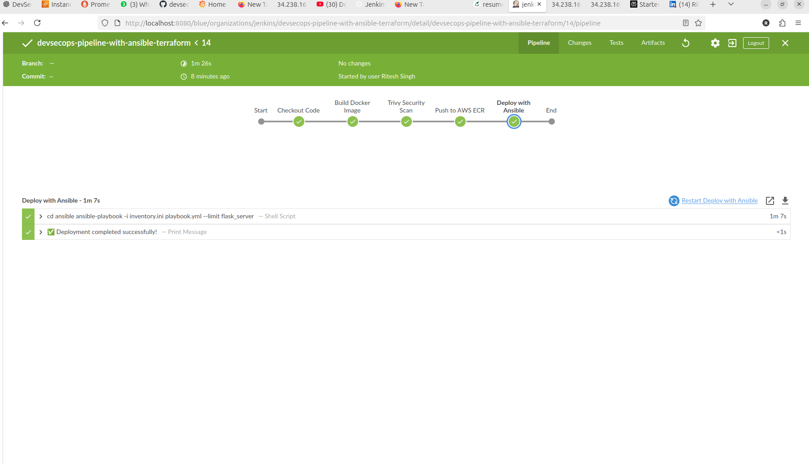

---

**Notes:**

* Pass variables `image_tag` and `ecr_repo` to Ansible using `-e`.
* Use `sshagent` Jenkins plugin and SSH credential type for the private key; ensure the credential ID matches.

---

## 7 — Security: Trivy, SonarQube, Ansible Vault, IAM best practices

**Trivy**

* Integrate Trivy scan in pipeline. Fail builds for `HIGH/CRITICAL` if policy requires.
* Keep a policy: fail when critical vuln found, allow medium/low with warnings.
  
 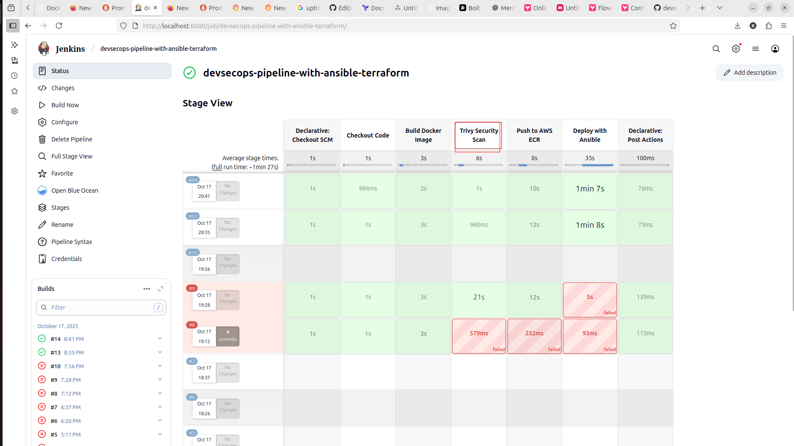

---

**SonarQube**

* Optional code-quality & SAST. Could be run in Jenkins stage. Use Sonarqube scanner plugin.

---

**Ansible Vault**

* Store sensitive variables (e.g., DB passwords) in `group_vars/.../vault.yml` encrypted with ansible-vault.
  ```
  ansible-playbook -i inventory.ini playbook.yml --ask-vault-pass
  
  ```

* Use `ansible-vault encrypt_string` or `ansible-vault create`.

* In Jenkins, store the vault password in credentials and pass with `--vault-password-file` or `--vault-id` securely.

**these are the commands which i used**
1. Run playbook with the encrypted inventory file
```
ansible-playbook -i inventory.ini playbook.yml --ask-vault-pass
```

2. Edit the encrypted inventory later
```
ansible-vault edit inventory.ini
```

3. Decrypt if needed
 ```
   ansible-vault decrypt inventory.ini
```

---
**Jenkins credentials**

* Use Jenkins Credentials store (AWS keys, SSH keys, GitHub token). Never commit secrets.
* Use `sshagent` plugin to make SSH keys available to the build agent for the duration of the block.
  

  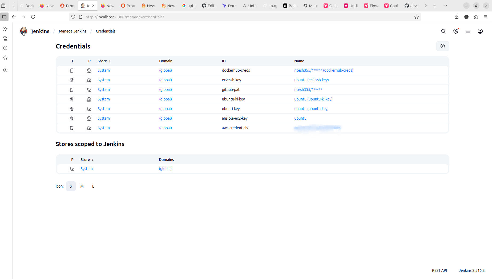

---
**IAM roles & policies**

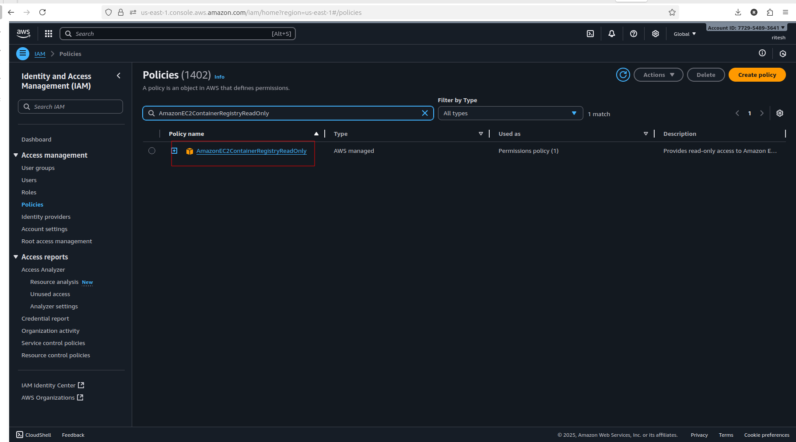


* Use least-privilege:

 * ECR push/pull: `AmazonEC2ContainerRegistryPowerUser` or custom policy limited to the repo.
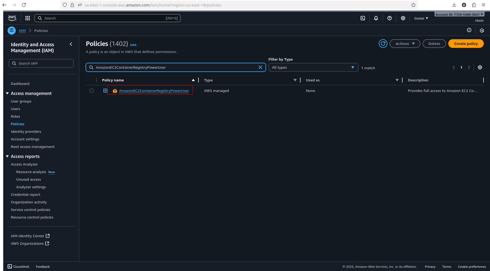

* EC2 instance profile for servers that will `docker pull` to fetch images should have ECR read access or use `AmazonEC2ContainerRegistryReadOnly`.
* Prefer instance profiles over hardcoded AWS keys on hosts.

---

## 8 — Monitoring: Prometheus + Grafana + Node Exporter + Jenkins plugin

**Prometheus**
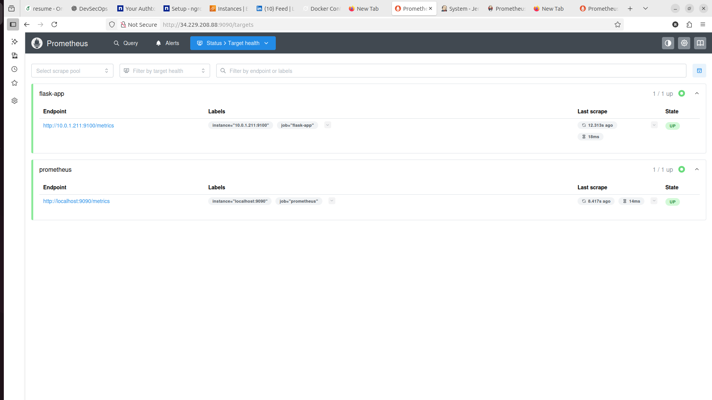

* Add scrape targets:

  * Node Exporter on EC2 instances: `<ec2_private_ip>:9100`
  * Flask app (if instrumented): `<flask_ip>:5000/metrics` (use `prometheus_flask_exporter`)
  * Jenkins: `metrics_path: '/prometheus'` (requires Prometheus plugin)

**Grafana**
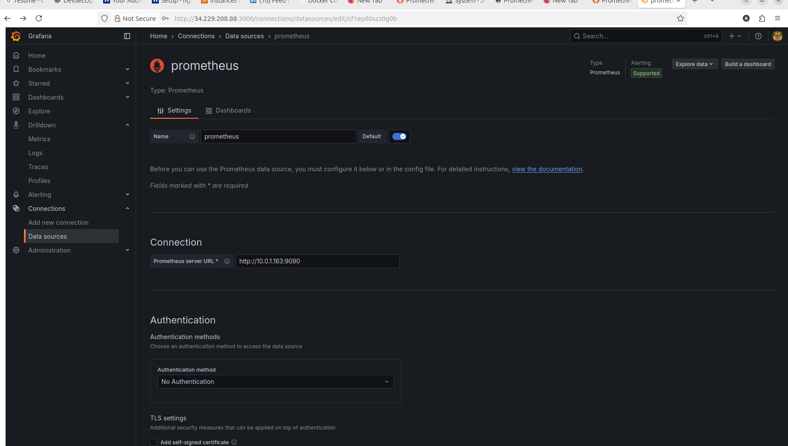

* Add Prometheus datasource: URL `http://<prometheus_host>:9090`
* Import dashboards:

  **Node Exporter Full (ID 1860)**
    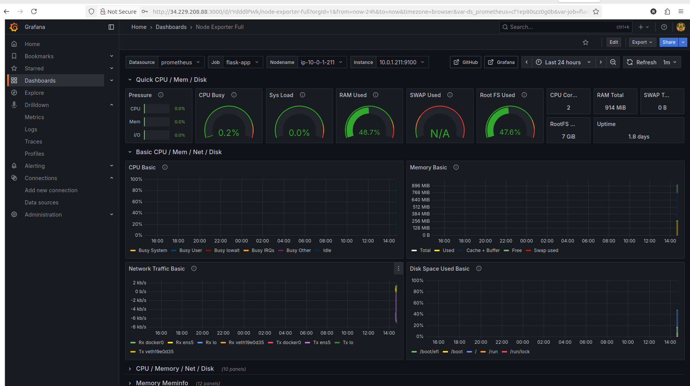

  **Docker Monitoring → Dashboard ID: 12227**
        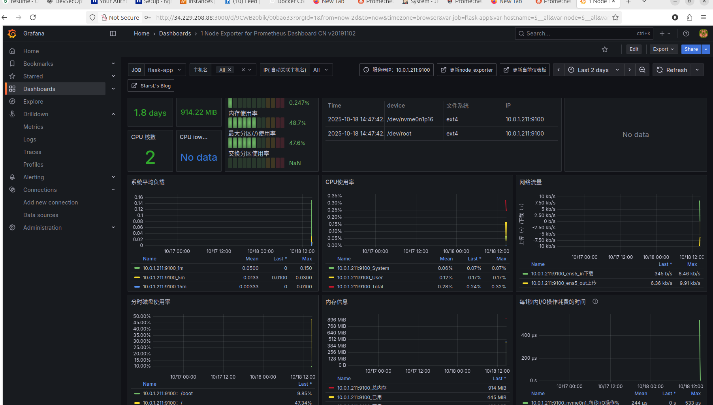

  **Prometheus 2.0 Stats → Dashboard ID: 3662**
          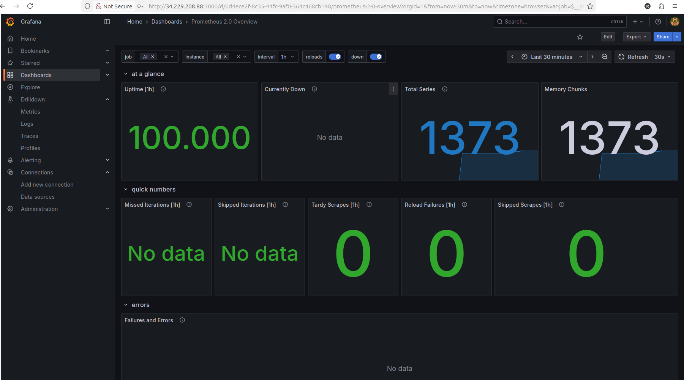


  **Set up Alerting in Grafana**
          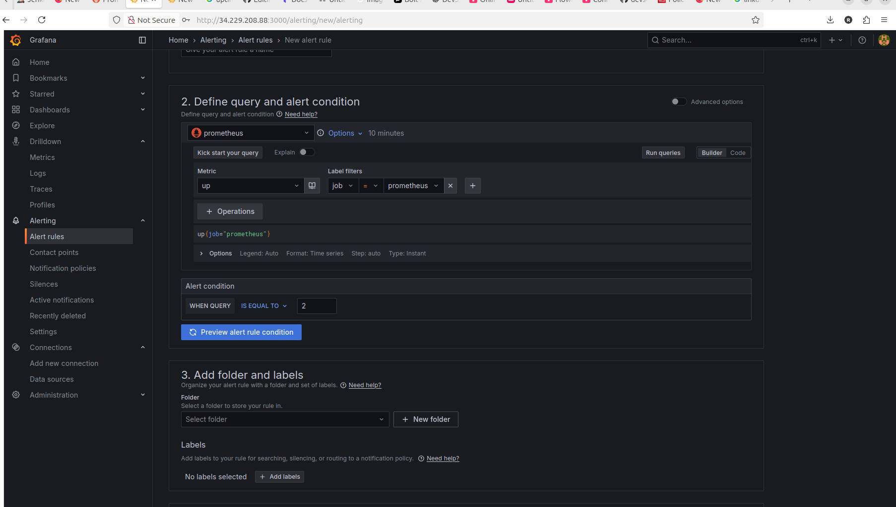

    


## 9 — Correct workflow (step-by-step) + diagram

**High-level workflow**

1. Developer pushes code to GitHub.
2. Jenkins job triggers on git push.
3. Jenkins pulls code, builds Docker image.
4. Jenkins runs Trivy scan.

   * If Trivy finds critical issues → fail the build.
5. If scan passes → Jenkins logs in to ECR and pushes the image with tag (`build-N`).
6. Jenkins calls Ansible (via `sshagent`) passing `image_tag`.
7. Ansible logs into target EC2 (using Ansible role with proper IAM or ECR login) and pulls the pushed image, stops old container and spins up a new one (docker run).
8. Prometheus scrapes Node Exporter and application metrics; Grafana visualizes and triggers alerts.


## 10 — Troubleshooting & common pitfalls

* **Ansible SSH fails**: make sure Jenkins loads private key via `sshagent` and inventory does NOT hardcode `ansible_ssh_private_key_file` pointing to a path that doesn’t exist on Jenkins agent. Use `ansible_user=ubuntu` in inventory and `sshagent` to supply key.
* **ECR login failing**: ensure Jenkins has AWS credentials or EC2 instance running Ansible has IAM instance profile for ECR. Also use `aws ecr get-login-password | docker login`.
* **Docker permission denied**: ensure Jenkins user in `docker` group or run docker commands via sudo; prefer adding user to group and restarting session.
* **Prometheus YAML errors**: YAML is whitespace-sensitive. Use 2-space indentation and validate with `docker run --rm -v /path/prom.yml:/etc/prometheus/prometheus.yml prom/prometheus --config.file=/etc/prometheus/prometheus.yml` to see parse errors.
* **Prometheus target 404**: target reachable but wrong path. For Jenkins use `/prometheus` (plugin). For Node Exporter use `/metrics` on port 9100.
* **Trivy not found** in Jenkins: install Trivy system-wide or add an `Install Trivy` stage in Jenkinsfile.
* **Ansible variable recursion**: always pass required variables (`image_tag`, `ecr_repo`) from pipeline into Ansible (`-e "image_tag=${IMAGE_TAG} ecr_repo=${ECR_REPO}"`).

---

## 11 — Useful commands & snippets

**Docker run Prometheus (host-mounted config):**

```bash
docker run -d --name prometheus -p 9090:9090 -v /home/ubuntu/prometheus.yml:/etc/prometheus/prometheus.yml prom/prometheus
```

**Start Node Exporter:**

```bash
docker run -d --name node_exporter -p 9100:9100 prom/node-exporter
```

**ECR login & push (shell):**

```bash
aws ecr get-login-password --region us-east-1 | docker login --username AWS --password-stdin 772954893641.dkr.ecr.us-east-1.amazonaws.com
docker tag local-image:latest 772954893641.dkr.ecr.us-east-1.amazonaws.com/flask-app:build-1
docker push 772954893641.dkr.ecr.us-east-1.amazonaws.com/flask-app:build-1
```

**Ansible run (manual):**

```bash
ansible-playbook -i ansible/inventory.ini ansible/playbook.yml --limit flask_server -e "image_tag=build-1"
```

**Validate Prometheus yaml (debug):**

```bash
docker run --rm -v /home/ubuntu/prometheus.yml:/etc/prometheus/prometheus.yml prom/prometheus --config.file=/etc/prometheus/prometheus.yml --log.level=debug
```

---

## Final notes & tips

* **Don’t store secrets in repo**. Use Jenkins credentials and Ansible Vault.
* **Use IAM roles** for EC2 instances that need to pull images from ECR — avoids storing keys on servers.
* Test **individual steps locally** first (Docker build & run, Ansible tasks to install Docker & pull image).
* Keep your **prometheus.yml** simple and validate YAML syntax when editing.

---
## 👨‍💻 Author

**Ritesh Singh**

🌐 [LinkedIn](https://www.linkedin.com/in/ritesh-singh-092b84340/) 
|
📝 [Hashnode](https://ritesh-devops.hashnode.dev/) 
|
💻[GitHub](https://github.com/ritesh355/)
|
🌐 [LinkedIn](https://dev.to/ritesh355)
